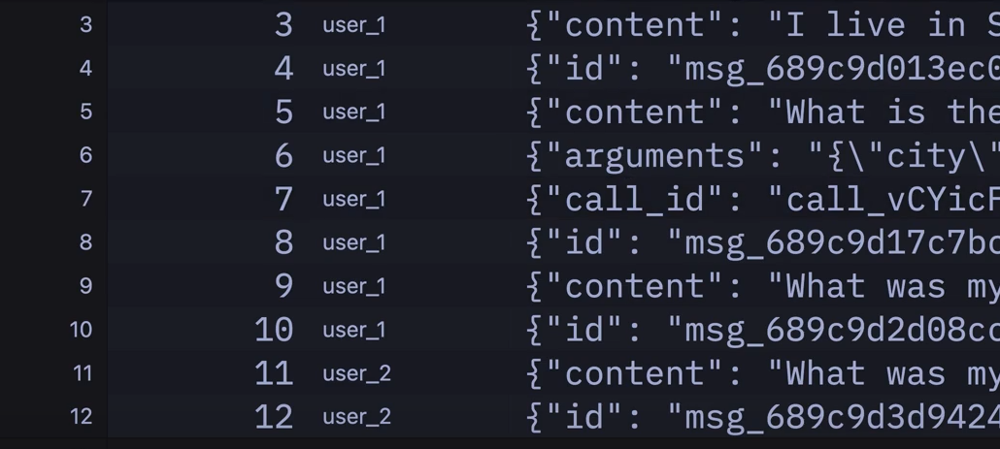

프로젝트 하나엔 하나의 가상 환경 안그럼 헷갈려서 커널이 인식 못함 

1. User → Runner

2. Runner → OpenAI
   (messages, tools 전달)

3. OpenAI → Runner
   (tool_calls 또는 일반 응답 반환)

4. Runner
   - tool_calls 확인
   - 필요한 Tool 실행

5. Runner → OpenAI
   (tool 결과를 tool message로 전달)

6. OpenAI → Runner
   (최종 답변 생성)

7. Runner → User

툴을 주고 싶을 때 :import function_tool 하면 됨

1. 서버 → OpenAI
   "550번 영화 출연진 알려줘"

2. OpenAI → 서버
   "get_movie_credits(550) 호출해줘"

3. 서버
   get_movie_credits(550) 실행

4. 서버 → OpenAI
   "함수 결과는 이거야"
   {
      "cast": [...]
   }

5. OpenAI → 서버
   "출연진은 Brad Pitt, Edward Norton 입니다."

6. 서버 → 사용자
   최종 답변 전달

   OpenAI는 Tool을 직접 실행하지 않고, "이 함수를 호출해 달라"고 요청만 한다. 실제 함수 실행은 서버가 하고, 결과를 다시 OpenAI에 전달하면 OpenAI가 그 결과를 바탕으로 최종 답변을 생성한다.

Runner의 run method 쓰고 싶지 않음  왜냐 chatgpt clone을 만드는데 도움이 안됨
응답을 엄청 오래 기다리고 있음 

=> Runner.run_streamed 실시간으로 업데이트 스트림
await Runner.run 에서 왜 await 씀? -> 결과 나올때까지 멈춰

async for event in stream.stream_events(): 비동기로 받아 실시간으로 프론트에 전달 가능 

agent_updated_stream_event 
- openaiagents SDK는 agent swarm(무리)를 만들 수 있게 해준다  여러 agents가 연결 됨 
- 새 agent가 대화를 처리할 때
- 사용자에게 다른 agent와 대화를 하고 있다고 표시 할 때 사용

name = "Assistant Agent"라고 하면 가끔 agent가 다른 agent로 넘어갈 수 있다는 의미
예를 들어 환불 원하는 고객이 있음 분류 agent 만나면 모르겠어요 하고 다음 환불 agent를 만날 때처리
기술 지원원하는 고객이 분류 agent 만나면 기술지원 agent로 보내거나 처리 가능 

RawResponsesStreamEvent -> 리얼 타임
response.function_call_arguments.delta 일 때 agent가 텍스트를 조금씩 쓰고 있음 

RunItemStreamEvent 
- agent가 tool를 사용 하거나 우리에게 message같은 response 주는 내용
- 나중에 ui에서 event가 뭔지에 따라서 event를 보여줘야 함 
- 하나의 run은 기본적으로 agent와 input
- run은 우리가 final response를 받을 때까지 끝나지 않음 하나의 run은 마지막 대답을 받을 때 까지 
- run은 while true loop 임  run 안에 여러 번의 loop가 있을 수 있음
한 run에서 agent가 여러개의 tool를 호출 할 수 도 있음 / 다른 agent로 넘어가서  loop
RunItem은 run에서 agent가 취한 action
 - agent가 tool을 쓰고 있는지 
 - 어떤 tool 쓰는지
 - agent가 tool을 호출하고 있는지
 - 메시지를 작성하고 있는지

 tool_call_item -> agent가 tool호출
====================
tool_call_output_item -> tool이 output을 줬다는 알림 / 
====================
message_output_item -> 우리에게 message를 줬다느 알림 
handoff_call_iten -> transfer 다른 에이전트로 넘어감

ItemHelpers : item 을 다루는 것을 도와줌 

AI 응답은 다 스트리밍 형 왜냐 대답 하는데 오래 걸려서

===============
import
SQLiteSession : 대화 내용을 저장 하는 db session 조작 가능(메시지 추가 삭제 )
여러 사용자 여러 스레드 처리 가능   
하나의 db로 여러개의 대화 한번에 가능

session = SQLiteSession("user_2","ai-memory.db") 이렇게 지정 하면 하나의 db에 여러 사용자 대화 저장 가능

만약 이 sqlite가 아니고 다른 db 연결 하고 싶으면 seeion 규약을 따르는 class를 구현 해야 함 

get_items를 호출할 때 모든 메시지를 가져오면 api 호출 비용이 비싸져서 마지막 50개 한정으로 가져오기 가능
백그라운드에서 대화를 요약할 수 있음 예전 메시지를 요약 

==============
handoffs :  에이전트가 다른 agent로 작업을 넘길 수 있게 해줌

시작 에이전트 한테 sub 에이전트가 있다는 사실을 알려야 함 
handoffs = [geography_agent, economics_agent]

서브 에이전트에는 
handoff_description = " " 을 넣어서 메인 에이전트가 이 서브 에이전트가 뭘 하느지 알 수 있도록 씀 

===============
from pydantic import BaseModel
class Answer(BaseModel):
    answer:str
    background_explanation:str
구조화 된 출력 가능

=====
여러 run을 하나의 tracing으로 할 때

====
- streamlist 에서 데이터의 흐름
수정 시 전체 재 실행  
모든게 다시 실행 되었는데 data를 어떻게 가질 수 있지? -> 저장 공간 만들어야 함
- session state 데이터 어떻게 넣거나 관리 하는지 
리렌더링 되어도 데이터 유지 
if "is_admin" not in st.session_state:
    st.session_state["is_admin"] = False 한번만 넣겠다라는 의미
    