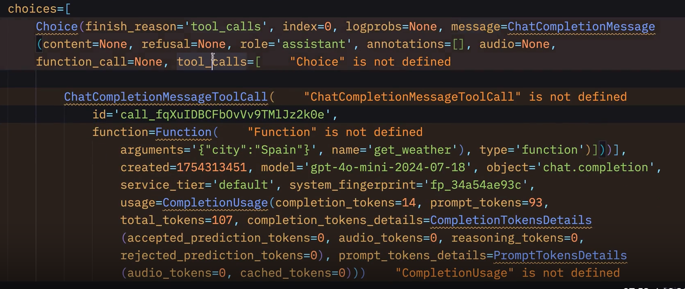

ai에게 알려주는 것
1. 내가 어떤 함수를 가지고 있는지
2. 그 함수들이 어떻게 생겼는지 (이름은 뭔지/ 어떻게 호출하는지)
그리고 AI 한테 내가 어떤 함수를 호출해야 하는지 알려줘 라고 부탁 

모델이 내가 쓴 description을 읽고 어떤 함수를 호출할 지 고름 
tools에서 함수를 골랐다면 ai는 텍스트 메시지를 꺼내지 않고 함수 호출(tool_call)만 함 

첫번째 choice의 message 안에는  tool_call이 들어있고 한개의 toolcall이 담겨져있음 
그리고 그건 이 함수를 실행해주는데 arguments와 같이 실행 해 달라는 요청을 함 
그 다음 함수를 실행하는 건 내 몫 내가 이 함수를 컴퓨터에서 실행 해야 함
call의 id를 가져와서 이 함수 실행 후 응답 돌려주기 

1. Tool Schema를 모델에 제공한다.
2. 사용자의 질문을 전달한다.
3. 모델은 필요한 경우 tool_call을 생성해 어떤 함수를 어떤 인자로 실행할지 요청한다.
4. 클라이언트가 실제 함수를 실행한다.
5. 함수 실행 결과를 tool_call_id와 함께 모델에 전달한다.
6. 모델은 그 결과를 바탕으로 최종 답변을 생성한다.

정리본
1. AI에게 Tool Schema 제공
    함수 이름
    설명(description)
    파라미터(parameters)
2. 사용자 질문을 모델에게 전달
    모델은 Tool Schema를 참고하여 필요한 함수가 있으면 message.tool_calls 생성
    즉, "이 함수를 이 인자로 실행해 달라"는 요청
3. 클라이언트(내 프로그램)가 tool_call을 받아 실제 함수를 실행
    tool_call.function.name
    tool_call.function.arguments를 사용하여 함수 실행
    실행 결과를 role="tool" 메시지로 다시 모델에게 전달
    이때 해당 결과가 어떤 tool 호출의 결과인지 알 수 있도록 tool_call_id에 원래의 tool_call.id를 넣어줌
4. 모델은 Tool 결과를 보고 최종 답변 생성

